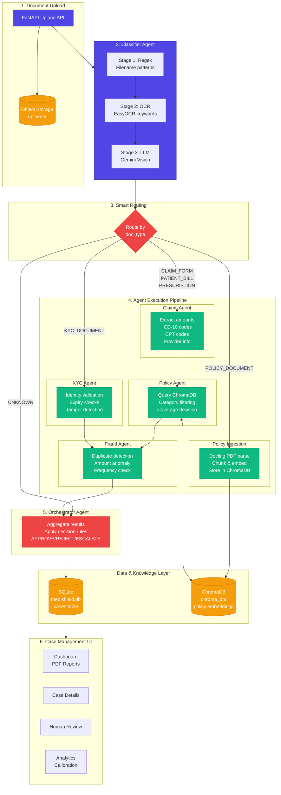
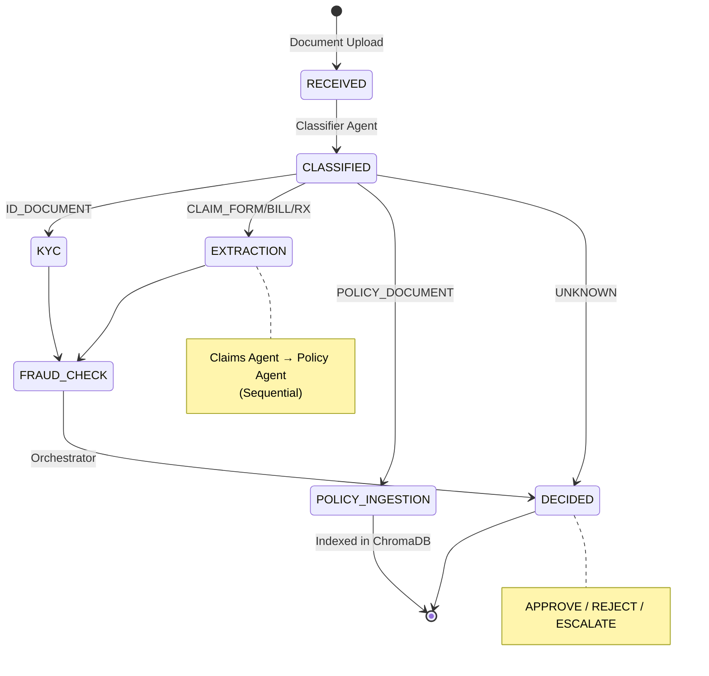

# MediShield Architecture Diagram

## Mermaid Diagram (renders in GitHub/VS Code)



## Pipeline State Machine



## Routing Table

| Document Type | Flow |
|--------------|------|
| `CLAIM_FORM` | Classifier → Claims → Policy → Fraud → Orchestrator |
| `PATIENT_BILL` | Classifier → Claims → Policy → Fraud → Orchestrator |
| `PRESCRIPTION` | Classifier → Claims → Policy → Fraud → Orchestrator |
| `MEDICAL_REPORT` | Classifier → Claims → Policy → Fraud → Orchestrator |
| `KYC_DOCUMENT` | Classifier → KYC → Fraud → Orchestrator |
| `POLICY_DOCUMENT` | Classifier → Policy Ingestion → END |
| `UNKNOWN` | Classifier → Orchestrator (reject) |

## Tech Stack

| Component | Technology |
|-----------|------------|
| Orchestration | LangGraph |
| Vision LLM | Gemini Flash |
| OCR | EasyOCR (English, Hindi, Spanish) |
| PDF Parsing | Docling |
| Vector DB | ChromaDB |
| Relational DB | SQLite |
| Backend API | FastAPI |
| Frontend | Next.js + Tailwind |
| Observability | LangSmith Tracing |
| Reports | ReportLab PDF Export |

## Decision Logic

```
APPROVE: KYC passed + claim valid + covered + fraud_score < 0.3
REJECT:  KYC failed OR not covered OR schema invalid
ESCALATE: fraud_score >= 0.3 OR any confidence < 0.6 OR duplicate detected
```

## Bonus Features

| Feature | Description |
|---------|-------------|
| Multi-language OCR | EasyOCR supports English, Hindi, Spanish documents |
| LangSmith Tracing | Full observability of agent calls, latency, token usage |
| Confidence Calibration | CLI script + UI Analytics page with calibration curves and ECE metrics |
| PDF Audit Export | Download case reports as PDF via UI button or `/api/cases/{id}/report` |

## UI Pages

| Page | Path | Description |
|------|------|-------------|
| Dashboard | `/` | Upload documents, view cases, download PDF reports |
| Case Detail | `/cases/[id]` | Full case details with agent outputs |
| Review Queue | `/review` | Escalated cases with override capability |
| Analytics | `/analytics` | Confidence calibration curves, ECE, accuracy metrics |

## API Endpoints

| Method | Endpoint | Description |
|--------|----------|-------------|
| POST | `/api/cases` | Upload document, trigger pipeline |
| GET | `/api/cases` | List cases with filters |
| GET | `/api/cases/{id}` | Get case detail with agent outputs |
| GET | `/api/cases/{id}/report` | Download PDF audit report |
| GET | `/api/cases/{id}/image` | Get uploaded document image |
| PATCH | `/api/cases/{id}/override` | Override decision (escalated only) |
| GET | `/api/cases/escalated` | Get review queue |
| GET | `/api/cases/stats` | Get case statistics |
| GET | `/api/analytics/calibration` | Get calibration data for charts |
| POST | `/api/policies/index` | Index policy PDFs for RAG |
